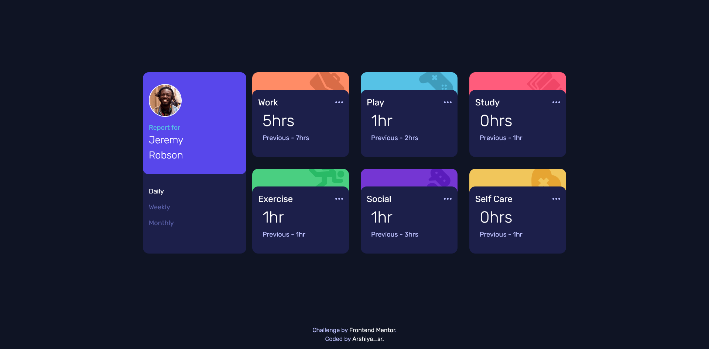
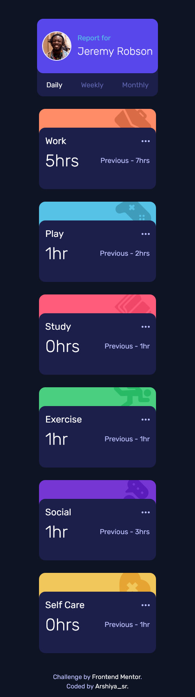

# Frontend Mentor - Time tracking dashboard solution

This is a solution to the [Time tracking dashboard challenge on Frontend Mentor](https://www.frontendmentor.io/challenges/time-tracking-dashboard-UIQ7167Jw). Frontend Mentor challenges help you improve your coding skills by building realistic projects. 

## Table of contents

- [Overview](#overview)
  - [The challenge](#the-challenge)
  - [Screenshot](#screenshot)
  - [Links](#links)
- [My process](#my-process)
  - [Built with](#built-with)
  - [Process](#process)
  - [What I learned](#what-i-learned)
  - [Continued development](#continued-development)
  - [Useful resources](#useful-resources)
  - [AI Collaboration](#ai-collaboration)
- [Author](#author)
- [Acknowledgments](#acknowledgments)

## Overview

### The challenge

Users should be able to:

- View the optimal layout for the site depending on their device's screen size
- See hover states for all interactive elements on the page
- Switch between viewing Daily, Weekly, and Monthly stats

### Screenshot

preview desktop annually: 

preview mobile: 

### Links

- Solution URL: [solution URL](https://github.com/arshiya-sr/frontend-mentor-Time-tracking-dashboard-Project)
- Live Site URL: [live site URL](https://arshiya-sr.github.io/frontend-mentor-Time-tracking-dashboard-Project/)

## My process

### Built with

- Semantic HTML5 markup
- CSS custom properties
- Advanced CSS
- Flexbox
- CSS Grid
- Mobile-first workflow
- Media queries
- Deepseek AI

### Process

This project didn't have a particular process to describe. Most of the effort went into building the precise appearance of the cards, which was solved with creativity, research, and a combination of methods. 

Also, changing the time order based on daily, weekly, or monthly was easily achievable with CSS without JavaScript, and it wasn't particularly complex.

### What I learned

I didn't learn anything particularly new from this project, but my existing skills were certainly reviewed and improved throughout the process.

### Continued development

Probably no additional or special work will be done on this project in the future. However, debugging and optimization will definitely be done after receiving the Frontend Mentor report and other people's comments and reviews.

### Useful resources

- [Deepseek AI](https://www.deepseek.com) - DeepSeek has helped me immensely on my learning journey—it's far better to use it for truly understanding concepts than for just getting answers and bypassing the work. And it helped me a lot more on this project.
- [github copilot AI](https://github.com/copilot) - GitHub Copilot has also been a huge help, especially when it comes to coding.
- [freecodecamp free online course](https://www.freecodecamp.org) - I gained my web development knowledge through freeCodeCamp, which is completely free and packed with resources: theory, labs, workshops, quizzes, and even review projects that help you master each topic. This project itself comes from freeCodeCamp, so a big thank-you to them.

### AI Collaboration

- What tools did you use (e.g., ChatGPT, Claude, GitHub Copilot)? i only used deepseek and github copilot AI a lot.
- How did you use them (e.g., debugging, generating boilerplate, brainstorming solutions)? i used it to help me understand the structure and debug small pieces of codes. also github copilot helped me nearly in all of it. It's really good.

## Author

- Github - [my github](https://github.com/arshiya-sr)
- Frontend Mentor - [my frontend mentor](https://www.frontendmentor.io/profile/arshiya-sr)
- freeCodeCamp - [my freecodecamp](https://www.freecodecamp.org/arshiya_sr)

## Acknowledgments

thank to Frontend Mentor for this awesome Project/Challenge, and thank to you for paying your time and attention to my project. I'd be so happy to receive your advice and recommendations.
Hope you a good day ♥
